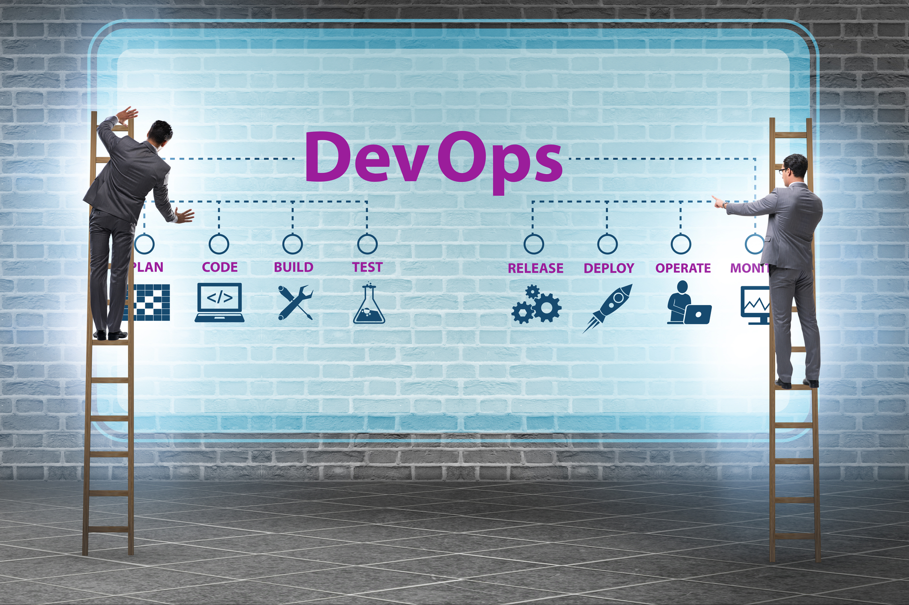

# About me

## Aloha, I'm Parth Vijay :wave: :man_technologist:

<!-- 
 
  Visitor count 
  

 -->

I am a DevOps Cloud Engineer. Over the years, I have gained a wide-ranging set of skills, qualities and attributes that, I believe, make me a competent, supportive, professional and flexible DevOps Engineer. In addition to possessing solid technical knowledge capabilities, I am also someone who has excellent communication, collaboration, and decision-making skills.

## Tech Stack:

<!-- - Language: Python
- Linux GNU Servers: Ubuntu, Red Hat Enterprise Linux, CentOS
- Configuration Management Tools: Ansible
- Containerization Tools: Docker, Kubernetes
- Version Control System: Git
- CI/CD Pipeline: using GitHub Actions, Jenkins, BitBucket, GitLab
- Cloud Computing: AWS, Google Cloud Platform, Azure, Digital Ocean, Heroku
- Monitoring Tools: ELK stack, Prometheus & Grafana
- Web Servers: Nginx, Apache2
- Database Server: Mysql, PostgreSQL -->

## My Blogs:

- [Deploy Angular App to Apache Server](https://parth-24073.medium.com/deploy-angular-app-to-apache-server-b7d87dab96df)
- [Deploying Django App inside Docker container running Apache2 with PostgreSQL, Pgadmin and Elasticsearch](https://parth-24073.medium.com/deploying-django-app-inside-docker-container-running-apache2-with-pgadmin-and-elasticsearch-e7cea4735016)
- [ElasticSearch integration with Logstash and Kibana to monitor Apache2 logs](https://parth-24073.medium.com/elasticsearch-integration-with-logstash-and-kibana-to-monitor-apache2-logs-b1f67570c357)
- [Configure CI/CD Pipeline in GitLab and deployment to server via SSH](https://parth-24073.medium.com/configure-ci-cd-pipeline-in-gitlab-and-deployment-to-server-via-ssh-b264a7f78db2)
- [CI/CD using GitHub Actions](https://parth-24073.medium.com/ci-cd-using-github-actions-f34bd6077e00)

## Github Stats:

<!-- 
  -->

<!-- ## Get in touch :coffee:: 

- [Medium](https://parth-24073.medium.com/)
- [LinkedIn](https://www.linkedin.com/in/parth-vijay-131bb9189) -->

## Get in touch :coffee::

   

## Ask Me:

-  💬 Ask me about anything [here](https://github.com/parth1625/parth1625/issues)
